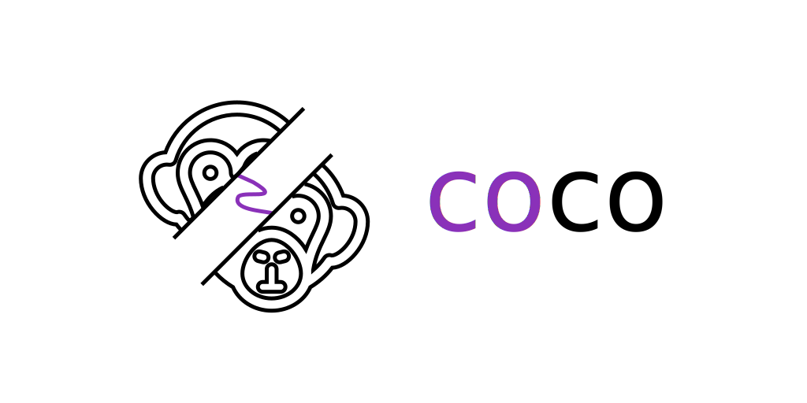

<p align="center">
  <picture>
    <source media="(prefers-color-scheme: dark)" srcset="assets/logo-dark.svg">
    
  </picture>
</p>

## 📃 Description

_Coco_ is a C++20 coroutine library that aims to be convenient and simple to use.  

## 📦 Installation

* Using [CPM](https://github.com/cpm-cmake/CPM.cmake)
  ```cmake
  CPMFindPackage(
    NAME           coco
    VERSION        3.2.0
    GIT_REPOSITORY "https://github.com/Curve/coco"
  )
  ```

* Using FetchContent
  ```cmake
  include(FetchContent)

  FetchContent_Declare(coco GIT_REPOSITORY "https://github.com/Curve/coco" GIT_TAG v3.2.0)
  FetchContent_MakeAvailable(coco)

  target_link_libraries(<target> cr::coco)
  ```

## 📋 Documentation

### `stray`

A simple coroutine primitive. This coroutine is evaluated eagerly and does not return anything.  

```cpp
coco::stray basic()
{
    co_await something();
}
```

### `task<T>`

This coroutine is evaluated eagerly and returns a result of type `T`.  
It is also possible to suspend the task until it is awaited (i.e. make it lazy evaluated) by calling `co_await task<T>::wake_on_await{};` from within it.

> [!WARNING]
> When using `co_await task<T>::wake_on_await` it is the users responsibility to ensure that the coroutine is actually awaited, otherwise the coroutine may never resume and thus leak memory.

```cpp
coco::task<int> task()
{
    co_await something();
    co_return 10;
}

coco::task<int> task_lazy()
{
    co_await coco::task<int>::wake_on_await{};
    co_return 10;
}

coco::stray basic()
{
    auto result      = co_await task();
    auto lazy_result = co_await task_lazy();
    // ...
}

void not_a_coroutine()
{
    auto result = coco::await(task());
    // or...
    coco::then(task(), [](int result) { /* ... */ });
}
```

### `promise<T> / future<T>`

A replacement for `std::promise<T>` / `std::future<T>` that allows to `co_await` the result.  

```cpp
coco::future<int> compute()
{
    auto promise = coco::promise<int>{};
    auto future  = promise.get_future();

 
    std::thread thread{[promise = std::move(promise)]() mutable
                        {
                            std::this_thread::sleep_for(std::chrono::milliseconds(500));
                            promise.set_value(10);
                        }};

    thread.detach();

    return future;
}

coco::stray basic()
{
    auto result = co_await compute();
    // ...
}

void not_a_coroutine()
{
    auto result = coco::await(compute());
    // or...
    coco::then(compute(), [](int result) { /* ... */ });
}
```

### `generator<T>`

A simple generator with iterator support.  
This generator does not support yielding another generator (i.e. no support for `ranges::elements_of`).  
Convenience member functions such as `find_if`, `find` and `skip` are also provided.

```cpp
coco::generator<int> generator()
{
    for (auto i = 0; 10 > i; ++i)
    {
        co_yield i;
    }
}

void not_a_coroutine()
{
    for (const auto& value : generator())
    {
        // ...
    }
}
```

### `latch`

A simple latch which can be awaited.

```cpp
coco::latch latch{2};

coco::stray basic()
{
    co_await something();
    latch.count_down();
}

coco::stray wait()
{
    basic();
    basic();
    
    co_await latch;    
}
```

### `forget` / `await` / `then` / `when_all`

Convenience functions for awaitable objects.

```cpp
task<int> some_task();
task<int> some_lazy_task();

void not_a_coroutine()
{
    // Discard a lazy `task<T>`
    coco::forget(some_lazy_task());
    
    // Synchronously await any awaitable
    auto result = coco::await(some_task());
    
    // Invoke callback when awaitable is resolved
    coco::then(some_task(), [](int) { /* ... */ });
    
    // Await multiple awaitables
    auto [r1, r2] = coco::await(coco::when_all(some_task(), some_lazy_task()));
}
```
